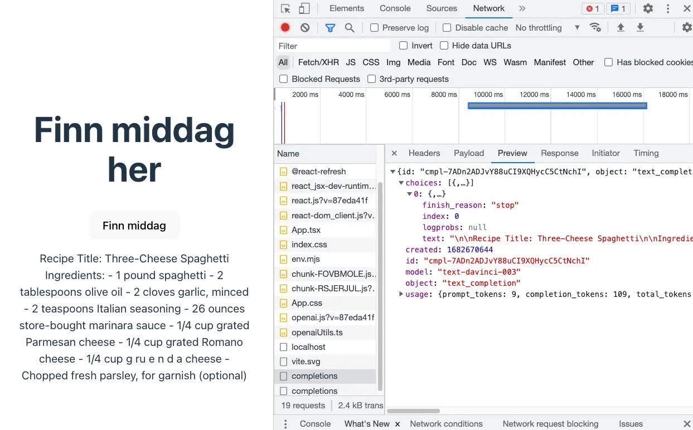
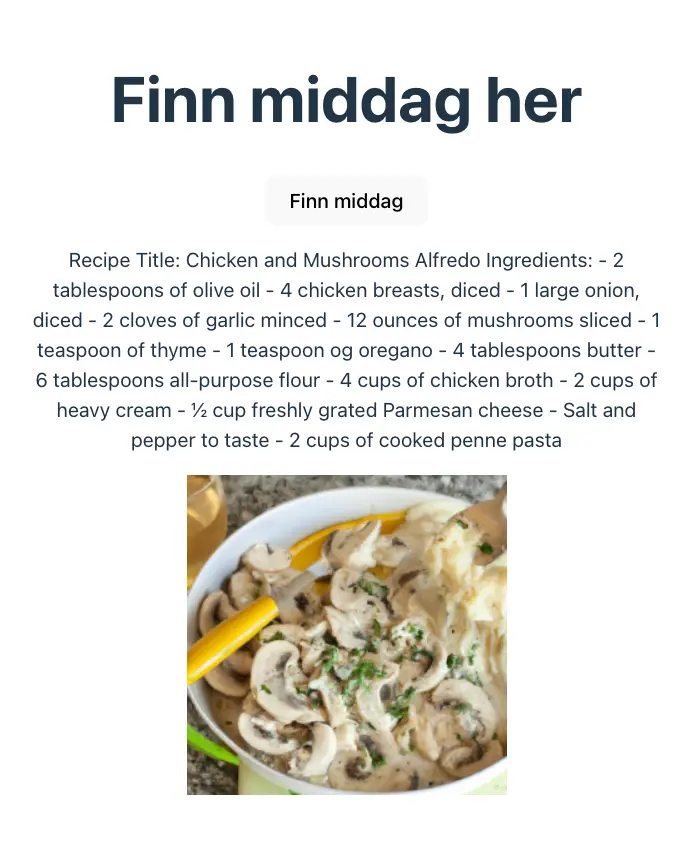
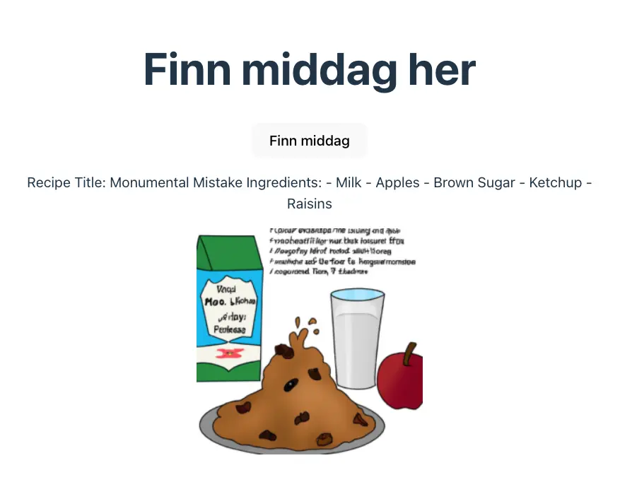

Med mindre du har levd under en stein de siste månedene, så har du fått med deg hvordan [OpenAI](https://openai.com/) sin ChatGPT har skapt global oppmerksomhet. Dette er et mektig verktøy som dytter oss et stort steg inn i framtiden, og kan løse det største I-landsproblemet av dem alle: “Hva skal vi spise til middag i dag?” Her er en guide om hvordan man kan bruke OpenAI med React.

**Tl;Dr:** [Github-repo](https://github.com/krissaberg/dinnergpt)

## The basics

La oss begynne fra start. Opprett et prosjekt med et fengende navn, gå i terminalen og “**cd**“ deg inn i riktig mappe. Jeg regner med du skal bruke [Vite](https://vitejs.dev/guide/), for det er fillern så raskt, så kjør derfor `npm create vite@latest` (mer om Vite i [Gautes bloggartikkel](/vite-frontend-tooling)). Pass på at du har Node.js-versjon 14.18+ eller 16+. Velg deretter React og Typescript.

Kjør deretter `npm install openai`, ([npm-pakke](https://www.npmjs.com/package/openai) og [OpenAIs bibliotek](https://platform.openai.com/docs/libraries)), og da er vi ready to go!

```
npm create vite@latest
> Project name: DinnerGPT
> Package name: dinnergpt
> Select a framework: React
> Select a variant: TypeScript
cd DinnerGPT
npm install
npm install openai
```

Vite, Node, React, Typescript *og* OpenAI – nå som dette er på plass er det bare å åpne prosjektet i din favoritt-IDE: [VSCode](https://code.visualstudio.com/). Åpne filen `src/App.tsx` og fjern eksempel-greiene fra koden, da vil `App.tsx` se omtrent slik ut:

```tsx
//App.tsx
import './App.css';

const App = () => {
  return <></>;
};
```

### OpenAI-API og konfigurering

Nå skal vi konfigurere OpenAI-API-et. Før det må vi skaffe en API-nøkkel. Først kan du opprette en fil kalt “.env” i prosjektet ditt. Dersom koden din skal på github må du huske å legge denne til i `.gitignore`, for der skal ikke sola slippe til. NB: OpenAI-biblioteket er ment for server-side, ikke client-side, ettersom det er mulig å grave frem API-nøkkelen fra kildekoden i nettleseren. Dersom koden din skal ligge på en åpen side, burde nøkkelen ligge på en egen server, enten ved å benytte server-side-rendering eller et backend API.

For å skaffe en API-nøkkel til OpenAI kan du opprette en bruker eller logge inn på OpenAI sin plattform og navigere til [oversikten over API-nøklene dine](https://platform.openai.com/account/api-keys). Trykk på “Create new secret key”, finn på et kult navn og kopier nøkkelen. Lim deretter nøkkelen inn i `.env`-fila di. NB: I Vite må nøkkelen prefikses med `VITE_`. Les mer på [Vite sine sider](https://vitejs.dev/guide/env-and-mode.html#env-files). 

```
//.env
VITE_OPEN_AI_API_KEY=sk-blabla
```

Opprett deretter en fil kalt `openaiUtils.ts`. Der sender vi API-nøkkelen inn i en konfigurasjon av OpenAI. Når man bruker Vite henter man nøklene fra `.env`-fila ved å bruke `import.meta.env.KEY_NAME`. Dersom du bruker Create React App bruker du `process.env.KEY_NAME`.

```ts
//openaiUtils.ts
import { Configuration, OpenAIApi } from 'openai';

const configuration = new Configuration({
  apiKey: import.meta.env.VITE_OPEN_AI_API_KEY,
});
const openai = new OpenAIApi(configuration);
```

### API-kallene

Nå har vi det vi trenger til å sende et par API-kall. I min app har jeg lyst til å få middagsforslag, så jeg vil spørre chatGPT om å få navnet på en oppskrift etterfulgt av en ingrediensliste. I tillegg vil jeg ha et bilde av denne matretten. Dermed skal to funksjoner brukes: `createCompletion` og `createImage`.

For å kun få tekst-svaret fra `createCompletion` og bilde-lenken fra `createImage`, putter jeg dem i hver sine funksjoner: `generateChatCompletion` og `generateImage`. Begge funksjonene tar inn `prompt: string`, som er selve søketeksten, og det er her vi kan sende inn mye gøy.

```ts
//openaiUtils.ts
export const generateChatCompletion = async (prompt: string) => {
  const response = await openai.createCompletion({
    model: 'text-davinci-003',
    prompt: prompt,
    temperature: 1.2,
    max_tokens: 1000,
  });

  return response.data.choices[0].text;
};

export const generateImage = async (prompt: string) => {
  const response = await openai.createImage({
    prompt: prompt,
    n: 1,
    size: '256x256',
  });
  return response.data.data[0].url;
};
```

I `createCompletion` kan man sende inn forskjellige modeller. Jeg følger bare eksempelet til OpenAI og bruker default “text-davinci-003”. [Her er listen over de forskjellige modellene](https://platform.openai.com/docs/models/model-endpoint-compatibility). `temperature` er en verdi mellom 0 og 2, og sier noe om hvor random et resultat er (der 2 er mest random). `max_tokens` er antall tegn på resultatet.

`CreateImage`-funksjonen tar inn `n: number` (1-10),  som bestemmer hvor mange bilder den skal generere.`size` er bildestørrelsen, og kan være 256x256, 512x512, eller 1024x1024. Det tar en stund å generere et bilde, så `n=1` og `size=256x256` passer fint for den utålmodige sjel.

### Lag middag

Tilbake i `App.tsx` – nå kan vi begynne å leke oss! La oss først lage en knapp som spør om en oppskrift fra OpenAI og viser resultatet som ren tekst. Vi lagrer den genererte oppskriften i en state hook kalt `generatedDinner: string`. Når man klikker på “Finn middag”-knappen kalles funksjonen `generateDinner` som sender teksten `PROMPT_RECIPE` inn i `generateChatCompletion` og oppdaterer `generatedDinner` med resultatet. Errorhåndteringen blir utført med en elegant logging til konsollen.

```tsx
//App.tsx
import './App.css';
import { generateChatCompletion } from './openaiUtils';
import { useState } from 'react';

const PROMPT_RECIPE = 'Give me a recipe title and list of ingredients.';

const App = () => {
  const [generatedDinner, setGeneratedDinner] = useState('');

  const generateDinner = async (chatPrompt: string) => {
    await generateChatCompletion(chatPrompt)
      .then((data) => data && setGeneratedDinner(data))
      .catch((e) => console.log(e));
  };

  return (
    <>
      <h1>Finn middag her</h1>
      <button onClick={async () => generateDinner(PROMPT_RECIPE)}>
        Finn middag
      </button>
      <p>{generatedDinner}</p>
    </>
  );
};

export default App;
```

Hvis du kjører `npm run dev` vil det se omtrent slik ut i nettleseren din etter du har klikket “Finn middag”:



Får du noen API-problemer har [OpenAI en fin oversikt](https://platform.openai.com/docs/guides/error-codes) over hva du kan gjøre.

Nå gjenstår det bare å generere et vakkert bilde av matretten. Vi endrer litt på `generateDinner`-funksjonen, oppretter en ny state hook kalt `generatedDinnerImageSrc` og legger til bildet i HTML-en, gitt at bildet eksisterer.

```tsx
//App.tsx
import './App.css';
import { generateChatCompletion, generateImage } from './openaiUtils';
import { useState } from 'react';

const PROMPT_RECIPE = 'Give me a recipe title and list of ingredients.';

const App = () => {
  const [generatedDinner, setGeneratedDinner] = useState('');
  const [generatedDinnerImageSrc, setGeneratedDinnerImageSrc] = useState('');

  const generateDinner = async (chatPrompt: string) => {
    await generateChatCompletion(chatPrompt)
      .then((data) => {
        data && setGeneratedDinner(data);
        data &&
          generateImage(`Cartoon image of ${data}`).then(
            (url) => url && setGeneratedDinnerImageSrc(url)
          );
      })
      .catch((e) => console.log(e));
  };

  return (
    <>
      <h1>Finn middag her</h1>
      <button onClick={async () => generateDinner(PROMPT_RECIPE)}>
        Finn middag
      </button>
      <p>{generatedDinner}</p>
      {generatedDinnerImageSrc && }
    </>
  );
};

export default App;
```



Og *voilà*! OpenAI er dermed i appen din. Nå er det bare å leke seg med forskjellige tekststrenger og se hvor mye gøy man får ut av det. OBS: For hver gang du sender en request til OpenAI så bruker du av gratis-kvoten din som er på 5 dollar. Se hvor mye du har brukt under []"Usage" på OpenAI sine sider](https://platform.openai.com/account/usage).

Her har jeg endret `PROMPT_RECIPE` til “Give me a recipe title and list of ingredients that don't fit together”; og sender inn `` `Cartoon image of ${data}` `` som prompt til `generateImage`:



Github-repoet kan du finne [her](https://github.com/krissaberg/dinnergpt).