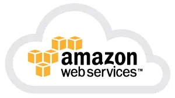

Amazon Web Services, bedre kjent som AWS, har vokst seg fra å introdusere fillagring som en tjeneste i 2006, til å bli verdens desidert største skyplattform. Selv om stadig flere konkurrenter kommer på banen klarer de ikke å dytte AWS ned fra den øverste plassen på pallen.

Den unektelige suksessen til AWS handler om så mye mer enn å ha hatt rett idé til rett tid. Plattformen er sikker, fleksibel, tilpasningsdyktig, forutsigbar og pålitelig. Da vi i Capra skulle bestemme hvilken plattform vi ønsket å satse på var valget enkelt. AWS. Og det er det flere gode grunner til.

## Et av de største kompetansemiljøene på AWS

Capra Consulting er et av de største kompetansemiljøene på Amazon Web Services i Norge, noe som både gagner våre kunder og våre ansatte. Vi er [APN Advanced Tier Consulting Partner](https://aws.amazon.com/partners/find/partnerdetails/?n=Capra%20Consulting%20AS&id=0010L00001oc2DGQAY), og har over 25 AWS-sertifiserte medarbeidere som kan hjelpe med å gjøre overgangen til offentlig sky smertefritt. Sertifiseringene våre gir oss dyp innsikt i tjenestene til AWS, og sørger for at våre ansatte har et teoretisk og praktisk grunnlag å bygge videre på i faktiske prosjekter.

I dag samarbeider Capra tett med AWS, slik at både skyen og ny teknologi alltid er lett tilgjengelig for alle våre kunder. I vår egenutviklede tjeneste for skreddersøm, [Liflig](https://www.liflig.no/), benytter vi selvsagt AWS. Dette sikrer at vi kan møte selv de mest kompliserte behov.

## En plattform vi og våre kunder kan stole på

AWS har vist seg å være utrolig pålitelig når det kommer til motstandsdyktighet i turbulente tider.. Amazon Web Services sin totale nedetid er nemlig betydelig lavere enn nedetiden til konkurrenter som Microsoft og Google. Dette gir en plattform som våre kunder kan stole mer på, og som er enklere å jobbe med for våre ansatte. En av hovedgrunnene til at vi i Capra har valgt å bli spesialister på nettopp AWS er hvordan plattformen presterer både til hverdags og under press.

## AWS er svært fleksibel, tilpasningsdyktig og skalerbar

Her i Capra har vi også falt for hvor skalerbar, fleksibel og tilpasningsdyktig plattformen faktisk er. Utviklerne av AWS skapte tidlig grobunn for en infrastruktur som enkelt kunne skaleres opp og ned raskt, for å møte de alltid flytende behovene til ulike bedrifter. I dag er AWS kjent for sin fleksibilitet, og bedrifter som tar i bruk skyplattformen slipper å forholde seg til begrensninger de er vant til å leve med i en fysisk infrastruktur. Her kan du være trygg på at tilgang til servere og lagring alltid er tilgjengelig.

## Garantert høy sikkerhet og tilpasningsdyktighet

Uansett hvor stor bedriften er vil AWS tilby samme nivå av sikkerhet. Her får man en løsning som møter de aller høyeste sikkerhetskrav, og det beste av alt er at man slipper å knote rundt med noe som helst på egenhånd. AWS støtter opp under alle de mest kjente compliance standardene i infrastrukturen sin, samtidig som de tilbyr et svært omfattende sikkerhetsregime. Her fås overvåkning i sanntid, slik at man kan oppdage mistenkelig aktivitet og potensielle sårbarheter med en gang.

Du skal også lete lenge før du finner en plattform som er like tilpasningsdyktig som AWS. Blant sine mange finurlige løsninger får du svært enkelt muligheten til å administrere den skybaserte infrastrukturen din med ulike programmeringsspråk. Dette gjør at plattformen  er enkel å jobbe med for alle programmerere.

Kunne du tenke deg å jobbe med AWS i et av Norges største kompetansemiljøer på plattformen? Eller gjorde denne artikkelen deg nysgjerrig på Capra som selskap? [Ta kontakt for en hyggelig og uforpliktende prat da vel!](https://www.capraconsulting.no/kontakt-oss) Vi gleder oss til å høre fra deg!