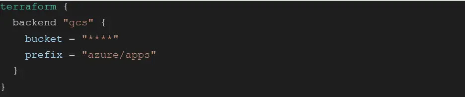
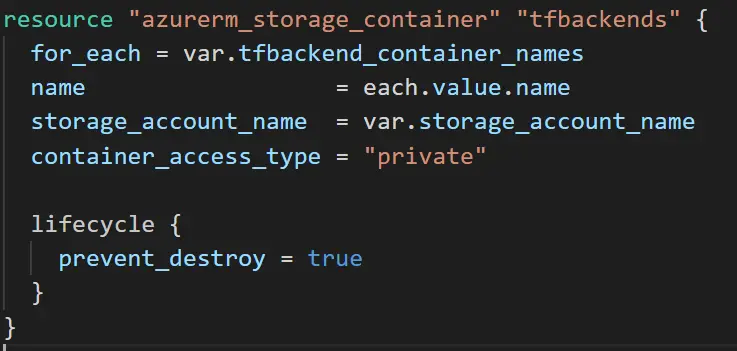
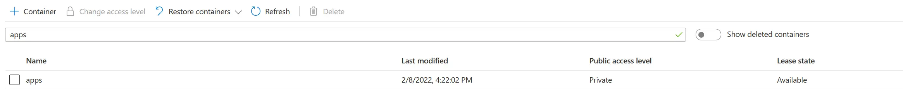
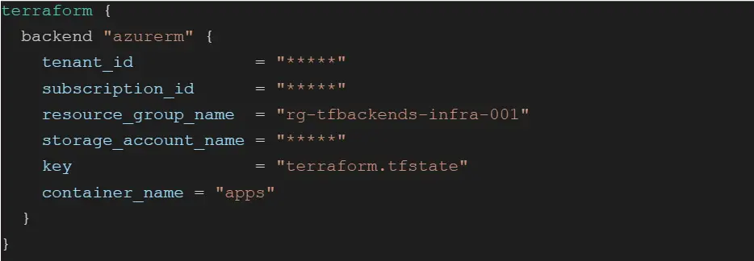
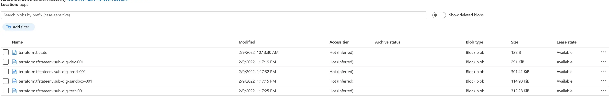

Noen ganger får man behov for å flytte filer fra en skyplattform til en annen. Det kan være på grunn av bytte av skyleverandør, eller kanskje man bare ønsker å konsolidere all lagring på en enkel tjeneste i et multicloud-miljø. En liten, men viktig detalj i migrasjonen er å bytte backend for Terraform. Må jeg kopiere over Terraform sin state manuelt? Er navnekonvensjonen på filene til Terraform lik på tvers av backend provider? Hva skjer med workspaces?

I denne artikkelen vil jeg guide deg gjennom denne prosessen. Jeg bruker en migrering fra Google Cloud Platform (GCP) til Azure som eksempel.

## Bytte backend

Som en del av Terraform-prosjektet definerer vi en backend. Denne peker til hvor Terraform lagrer sin tilstand. Nøyaktig hvordan dette gjøres er opp til implementasjonen, men i praksis betyr det at vi peker til en ressurs hvor vår backend provider lagrer et sett med filer som representerer Terraform sin interne tilstand.

Her er et backend-oppsett som peker på en Cloud Storage-ressurs på GCP:

Det første steget i migrasjonen er å kjøre “terraform init” med nåværende backend. Dette er viktig for at Terraform får med seg alle workspaces.

Neste steg er å endre backend i prosjektet til å bruke Azure. For å få til det må du først lage en Storage Account og container gjennom Azure Storage. Her brukte jeg et annet Terraform-prosjekt til å lage en Azure Storage account og deretter en container:

Her ser vi vår container på Azure Storage, klar til bruk:

I prosjektet jeg ønsket å migrere, byttet jeg så backend-oppsett til å peke på min nye Azure Storage container:

Etter det må “terraform init” kjøres igjen. Terraform vil oppdage at du har byttet backend provider, og du får valget om å overføre tilstanden:

`$ terraform init`

`Initializing the backend...`

`Backend configuration changed!`

`Terraform has detected that the configuration specified for the backend has changed. Terraform will now check for existing state in the backends.`

`Terraform detected that the backend type changed from "gcs" to "azurerm".`

`Do you want to migrate all workspaces to "azurerm"?`

`Both the existing "gcs" backend and the newly configured "azurerm" backend support workspaces. When migrating between backends, Terraform will copy all workspaces (with the same names). THIS WILL OVERWRITE any conflicting states in the destination.`

`Terraform initialization doesn't currently migrate only select workspaces.`

`If you want to migrate a select number of workspaces, you must manually pull and push those states.`

`If you answer "yes", Terraform will migrate all states. If you answer "no", Terraform will abort.`

`Enter a value: yes`

Når Terraform har kjørt ferdig vil migrasjonen være ferdig. Om du sjekker din container på Azure Storage vil du se at alle tfstate-filene, for alle workspaces er overført:

## Kort oppsummert

Så lett er det altså. Terraform gjør det aller meste av jobben. Ikke vær bekymret for å gjøre noe galt siden du fremdeles har kopier av state-filene liggende på den gamle backenden. Bare husk å informere de andre i teamet før du går i gang: Endringer som gjøres med gammel backend reflekteres naturligvis ikke i den nye tilstanden til Terraform etter at migrasjonen er gjort.