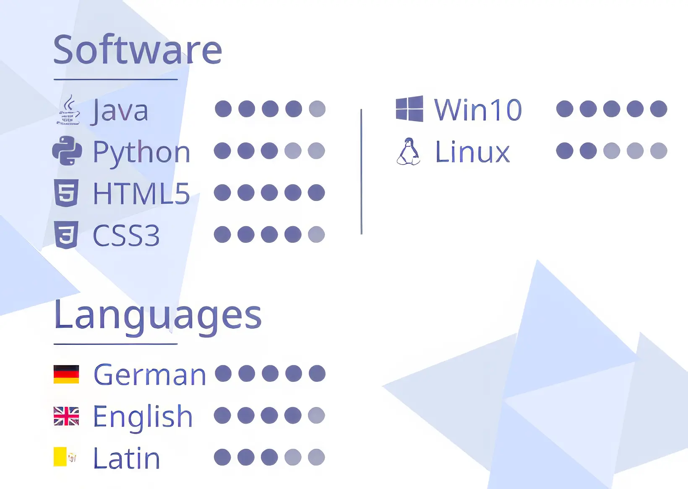

## 1. Plasser det mest relevante øverst på CV-en

Mange skriver en CV ved å liste opp utdanning og arbeidserfaring i omvendt kronologisk rekkefølge, altså fra det nyeste til det eldste. Imidlertid bør relevans prioriteres over kronologi. For eksempel: en malejobb du gjorde for onkelen din forrige sommer er kanskje ikke direkte relevant for en utviklerstilling. Prioriter derfor de mest relevante erfaringene – som tidligere prosjekter, frivillige verv, deltidsjobber, sommerjobber og universitetsutdanning – øverst på din CV. Mindre relevante erfaringer kan inkluderes, men bør plasseres lenger ned på listen.

## 2. Hva kan inkluderes av prosjekter og erfaringer?

Det er viktig å fremheve prosjekter og erfaringer som matcher stillingen du søker. Har du begrenset erfaring fra tidligere arbeidsforhold? Da kan skoleprosjekter som samsvarer med jobben du søker, være nyttige. Vær spesifikk når du beskriver dine roller, ansvarsområder og teknologier du har brukt i prosjektene (se punkt 5). For utviklere kan det være lurt å inkludere lenker til din GitHub-profil eller andre nettsider som gir arbeidsgiveren en bedre forståelse av dine ferdigheter og hva du kan bidra med. Hvis du har innehatt relevante posisjoner eller verv i frivillige organisasjoner, bør du absolutt inkludere dem i CV-en. Dette er ikke bare et bevis på din evne til å jobbe i team og samarbeide mot felles mål, men det fremhever også din proaktivitet og engasjement for kontinuerlig faglig vekst. I tillegg kan det gi verdifull praktisk erfaring og styrker din CV ytterligere.

## 3. Koble teknologier til konkrete erfaringer

Det er ikke uvanlig at søkere lister opp teknologier eller buzzwords de har kjennskap til uten å relatere dem til reelle erfaringer eller konkrete prosjekter. Dette kan gi arbeidsgivere et uklart eller feilaktig bilde av dine evner, ettersom de søker inngående kjennskap til din praktiske bruk av nevnte teknologier. For en klarere presentasjon, strukturer erfaringene dine i korte, konsise punkter, og beskriv din rolle i de nevnte prosjektene. Å inkludere relevante hobbyprosjekter kan også gi stor verdi hvis du trenger å fremheve mer teknisk erfaring.

**Eksempel:**

> Capra Consulting, Oslo, Summer Intern  
Juni 2020 - August 2020

vs.

> Capra Consulting, Oslo, Fullstack-utvikler  
Juni 2020 - August 2020
>
>- Utplassert hos kunde X
>- Har sammen med et team på fem utviklere jobbet med flere typer
sensordata, innhentet data fra eksisterende system, persistert og gjort disse tilgjengelig i AWS
>- Prosjektet har gitt verdi ved å visualisere sensordata på en fornuftig måte som kan brukes både internt og eksternt.
>- Teknologier: Terraform, Kotlin m/ Micronaut, React m/ TypeScript, AWS

## 4. Unngå å rangere ferdigheter på en skala

Mange studenter bruker illustrasjoner for å vise kompetansenivå med ulike teknologier (fig 1). Å bedømme egne ferdigheter objektivt kan være svært vanskelig, og en risikerer lett å falle for den velkjente [Dunning-Kruger-effekten](https://no.wikipedia.org/wiki/Dunning-Kruger-effekten). Selv seniorutviklere med mye erfaring er ofte forsiktige med å gi seg selv toppkarakter på en ferdighetsskala. Dessuten tar slike illustrasjoner opp mye plass. Vi mener det derfor er bedre å fokusere på konkrete prosjekter du har jobbet med og hvilken teknologi du har brukt. Dette gir en dypere innsikt i din ekspertise og setter den i en mer relevant sammenheng.

*(Fig 1) Kilde: https://dev.to/tim012432/do-not-put-skill-bars-on-your-resume-lh6*

## 5. Relevans og kvalitet over antall sider

Det er en utbredt misforståelse blant søkere at en CV skal begrenses til én A4-side. Mange forsøker dermed å tvinge all sin informasjon inn på denne lille plassen. Selv om en kortfattet CV kan være passende i mange situasjoner, bør en aldri ofre verdifull informasjon kun for å overholde en slik "standard". Hovedmålet er at CV-en skal gi en klar og oversiktlig presentasjon av din erfaring og kompetanse, uavhengig av sidetall. Men husk: en langdryg CV fylt med irrelevant informasjon kan skape et negativt inntrykk hos leseren. Fokuser derfor alltid på det som er relevant og viktig.

## 6. Vis din kreativitet

En tradisjonell CV produsert i programmer som Microsoft Word er ikke den eneste måten å presentere deg selv på. Å lage en kreativ CV kan være en flott anledning til å vise din unike personlighet og kompetanse, samt skille deg markant ut fra andre søkere. Du kan for eksempel lage en nettside som fungerer som din CV. Dette viser ikke bare dine tekniske ferdigheter, men tillater også en unik og engasjerende måte å strukturere informasjonen på. Mulighetene er mange, og vær ikke redd for å tenke utenfor boksen og skape noe som skiller deg ut i mengden!

## 7. Bruk navnet ditt som overskrift og velg et gjenkjennelig filnavn

Selv om "Curriculum Vitae" er en hyppig brukt tittel på en CV, kan den ofte virke generisk og oppta mye plass uten merverdi. Arbeidsgivere skummer ofte gjennom mange CV-er, så for å gjøre din CV mer gjenkjennelig, bruk ditt eget navn som overskrift. Filnavnet bør også være lett identifiserbart, for eksempel "Ola Nordmann CV.pdf". Dette hjelper arbeidsgiveren i organiseringen, og sikrer at din CV enkelt kan identifiseres og gjenfinnes. Husk at det kan være hundrevis av søkere til utviklerposisjoner i sommersesongen, og derfor er det viktig å gjøre alt for at din CV ikke går tapt i mengden. Som et siste tips, last alltid opp CV-en din som en PDF. Dette garanterer at formatering og layout forblir konsistent, uansett hvilken enhet eller programvare som benyttes for å se dokumentet.

## 8. Be en venn om tilbakemelding

Det lønner seg alltid å be noen andre om å gjennomgå CV-en din før innsending. Friske øyne kan raskt oppdage skrivefeil, grammatikkfeil eller områder som du ikke har lagt merke til selv. Det kan også være lurt å spørre om det er noe som kan formidles klarere eller mer effektivt. Kanskje de også kan påpeke relevante erfaringer eller kvalifikasjoner som du har oversett?

